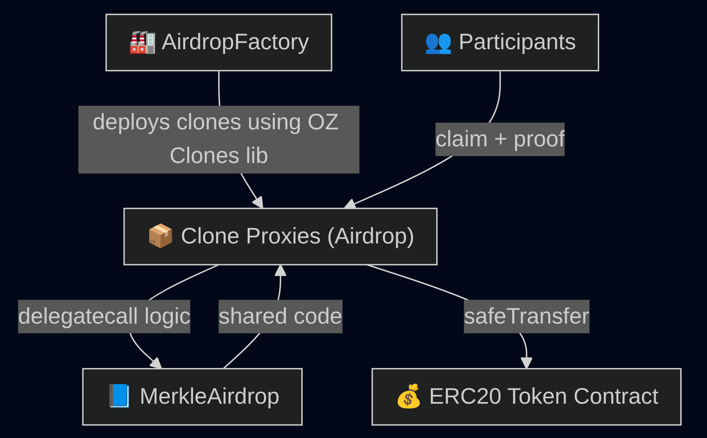
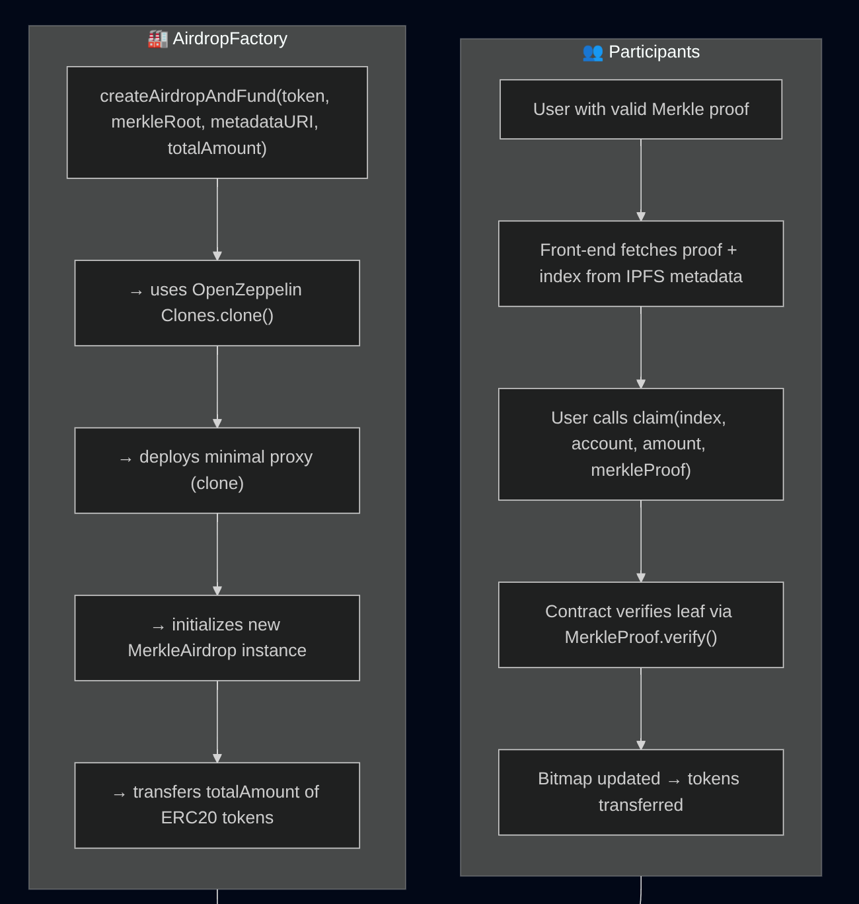
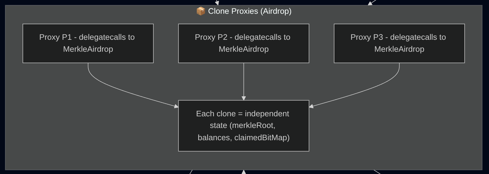
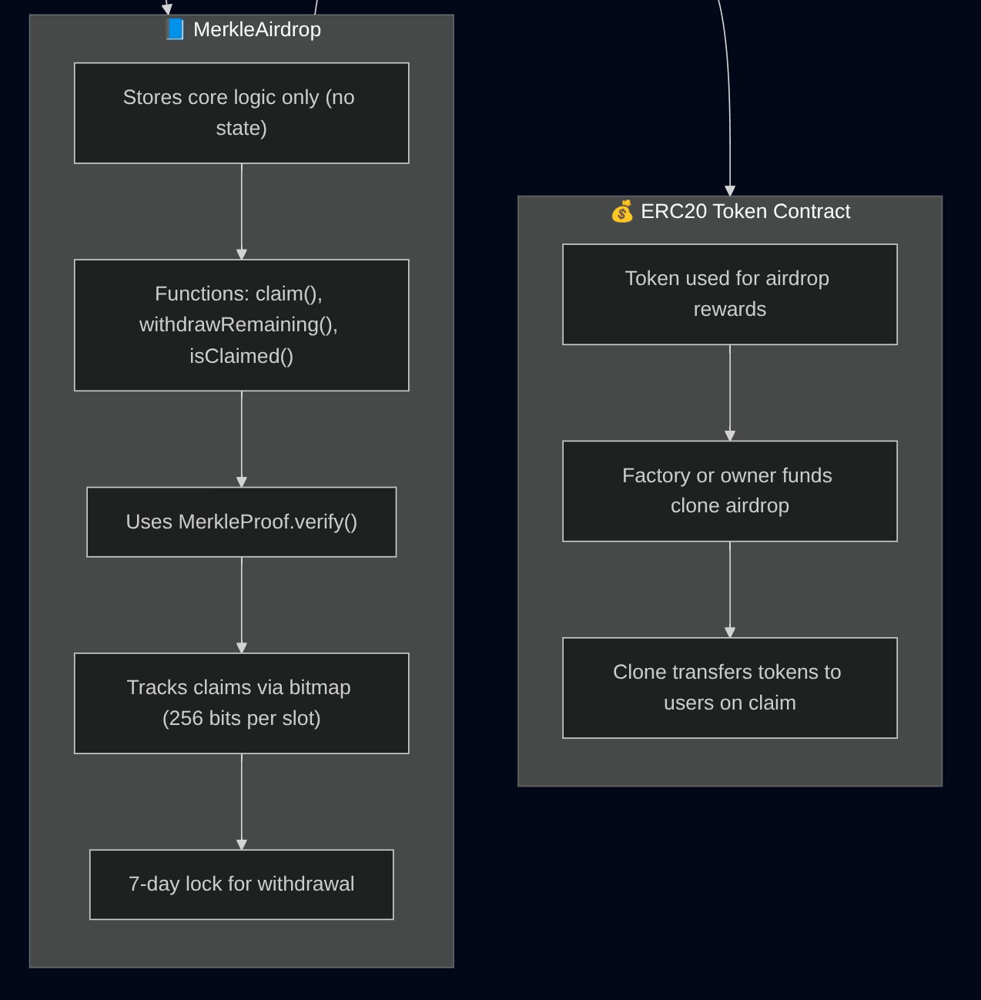
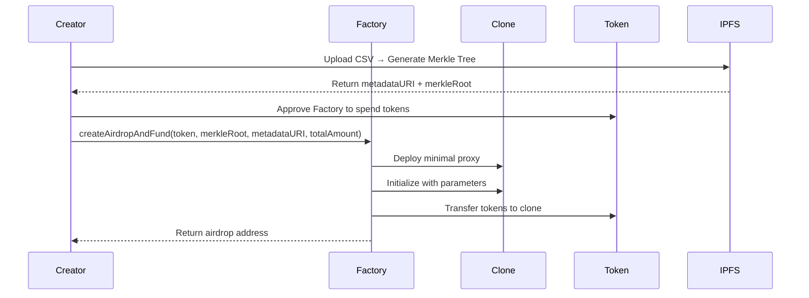
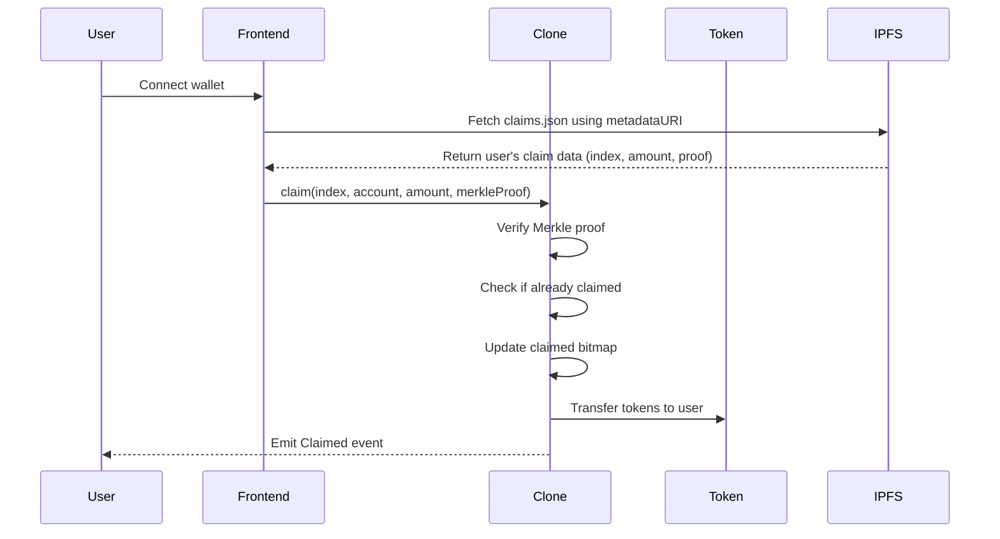
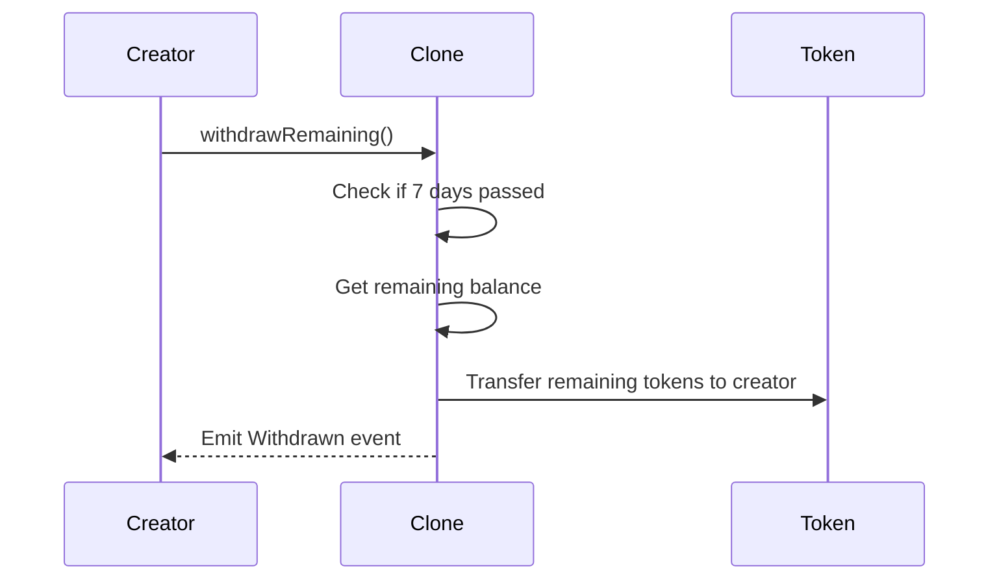

# 🏭 Airdrop Builder Smart Contracts

### Decentralized Merkle Airdrop System
*(Solidity 0.8.28 + OpenZeppelin + EIP-1167 Minimal Proxies)*

---

## 🧠 Overview

The **Airdrop Builder Smart Contracts** implement a gas-efficient, secure, and decentralized airdrop system using Merkle trees and EIP-1167 minimal proxy patterns. The system enables anyone to create airdrops with automatic funding and time-locked withdrawals for security.

### Key Features

- **🌳 Merkle Tree Verification** - Efficient on-chain eligibility checks
- **⚡ Gas Optimization** - EIP-1167 minimal proxy pattern for low deployment costs
- **🔒 Security First** - 7-day withdrawal lock prevents rug pulls
- **📦 IPFS Integration** - Decentralized metadata storage
- **🎯 Batch Operations** - Deploy and fund airdrops in single transaction
- **🛡️ Battle-Tested** - Built with OpenZeppelin libraries

---

## 🏗️ System Architecture & Workflow

### Complete Airdrop Flow

The following diagrams illustrate the complete airdrop system architecture and workflow:

#### 1. System Overview


The **System Workflow** shows the high-level architecture where:
- **AirdropFactory** deploys clone proxies using OpenZeppelin's Clones library
- **Participants** interact with clone proxies to claim tokens with Merkle proofs
- **Clone Proxies** delegate calls to the shared **MerkleAirdrop** implementation
- **ERC20 Token Contract** provides the tokens for distribution

#### 2. Factory & Participants Flow


**Left Column - AirdropFactory Process:**
1. **`createAirdropAndFund(token, merkleRoot, metadataURI, totalAmount)`** - Factory function call
2. **Uses OpenZeppelin Clones.clone()** - Deploys minimal proxy
3. **Deploys minimal proxy (clone)** - Gas-efficient deployment
4. **Initializes new MerkleAirdrop instance** - Sets up airdrop parameters
5. **Transfers totalAmount of ERC20 tokens** - Funds the airdrop

**Right Column - Participants Process:**
1. **User with valid Merkle proof** - Eligible participant
2. **Front-end fetches proof + index from IPFS metadata** - Retrieves claim data
3. **User calls claim(index, account, amount, merkleProof)** - Submits claim
4. **Contract verifies leaf via MerkleProof.verify()** - Validates eligibility
5. **Bitmap updated → tokens transferred** - Prevents double claims and transfers tokens

#### 3. Clone Proxies Architecture


**Clone Proxies Pattern:**
- **Multiple Proxy Instances** (P1, P2, P3) - Each represents a separate airdrop
- **Delegate Calls to MerkleAirdrop** - All proxies use shared implementation
- **Independent State** - Each clone maintains its own:
  - `merkleRoot` - Unique to each airdrop
  - `balances` - Token balances for each airdrop
  - `claimedBitMap` - Claim status for each airdrop

#### 4. MerkleAirdrop & ERC20 Integration


**MerkleAirdrop Contract:**
- **Stores core logic only (no state)** - Stateless implementation
- **Functions: claim(), withdrawRemaining(), isClaimed()** - Core functionality
- **Uses MerkleProof.verify()** - Cryptographic verification
- **Tracks claims via bitmap (256 bits per slot)** - Efficient storage
- **7-day lock for withdrawal** - Security mechanism

**ERC20 Token Contract:**
- **Token used for airdrop rewards** - The distributed asset
- **Factory or owner funds clone airdrop** - Initial funding
- **Clone transfers tokens to users on claim** - Token distribution

### Key Benefits of This Architecture

1. **Gas Efficiency** - EIP-1167 minimal proxies reduce deployment costs by ~95%
2. **Scalability** - Unlimited airdrops with shared implementation
3. **Security** - Merkle proofs prevent unauthorized claims
4. **Decentralization** - No central authority required
5. **Transparency** - All operations are on-chain and verifiable

### Detailed Technical Flow

#### Phase 1: Airdrop Creation


#### Phase 2: Token Claiming


#### Phase 3: Withdrawal (After 7 Days)


### Security Mechanisms

1. **Merkle Proof Verification**
   - Each claim requires a valid Merkle proof
   - Prevents unauthorized token claims
   - Efficient on-chain verification

2. **Double-Claim Prevention**
   - Bitmap tracks claimed status (1 bit per claim)
   - Gas-efficient storage pattern
   - Immutable claim records

3. **Time-Locked Withdrawals**
   - 7-day lock prevents immediate rug pulls
   - Creator cannot withdraw before lock expires
   - Transparent withdrawal timeline

4. **Access Control**
   - Only airdrop owner can withdraw remaining tokens
   - Only eligible users can claim tokens
   - No central authority required

---

## 🏗️ Contract Architecture

### Core Contracts

**MerkleAirdrop.sol** - Individual airdrop logic
- Merkle proof verification
- Claim tracking via bitmap
- Time-locked withdrawal system
- Event emission for indexing

**AirdropFactory.sol** - Factory for deploying airdrops
- EIP-1167 clone deployment
- Batch deployment and funding
- Event emission for tracking
- Deterministic deployment support

**IMerkleAirdrop.sol** - Interface definition
- Standardized airdrop interface
- Function signatures for integration

**MockERC20.sol** - Testing token
- Minting capabilities for testing
- Configurable decimals
- Standard ERC20 implementation

---

## 📁 Project Structure

```
smart-contract/
├── contracts/
│   ├── AirdropFactory.sol           # Factory contract
│   ├── MerkleAirdrop.sol            # Airdrop implementation
│   ├── interfaces/
│   │   └── IMerkleAirdrop.sol       # Interface definition
│   └── mocks/
│       └── MockERC20.sol            # Testing token
├── scripts/
│   ├── deploy-sepolia.ts            # Sepolia deployment
│   ├── create-airdrop-sepolia.ts    # Create test airdrop
│   ├── claim-airdrop.ts             # Claim tokens
│   ├── deployAndTest.ts             # Deploy and test flow
│   ├── generateTestData.ts          # Generate test data
│   └── view-transaction-logs.ts     # Debug transaction logs
├── test/
│   └── AirdropFlow.test.ts          # Comprehensive test suite
├── deployments/
│   ├── sepolia_deployment.json      # Deployment information
│   └── sepolia_airdrop_*.json       # Individual airdrop deployments
├── test-data/
│   ├── airdrop.csv                  # Original CSV upload format
│   ├── claims.json                  # IPFS metadata with proofs
│   ├── individual-claims.json       # Individual user claim data
│   └── merkle-data.json             # Merkle tree generation data
├── artifacts/                       # Compiled contracts
├── cache/                          # Hardhat cache
├── typechain-types/                # TypeScript types
└── hardhat.config.ts               # Hardhat configuration
```

---

## 📊 Data Flow & File Formats

### CSV Upload → Merkle Tree → IPFS → Smart Contract

The system processes airdrop data through several stages:

#### 1. Original CSV Format (`airdrop.csv`)
```csv
address,amount,index
0x1234567890123456789012345678901234567890,100.0,0
0x2345678901234567890123456789012345678901,200.0,1
0x3456789012345678901234567890123456789012,300.0,2
```

#### 2. Generated Claims Data (`claims.json`)
```json
{
  "metadata": {
    "name": "Test Airdrop Campaign",
    "merkleRoot": "0x6d43c20abc208559dd970943ba3fffff9c66d3c9ec1804e93958db82a377c2d8",
    "totalAmount": "2125000000000000000000",
    "claimDeadline": 1761812918,
    "unlockTimestamp": 1761812918
  },
  "claims": [
    {
      "index": 0,
      "account": "0x1234567890123456789012345678901234567890",
      "amount": "100000000000000000000",
      "proof": ["0x24920223f30fcc619dfc6409240274b48e55ef890a54cae81f4609141c445137"]
    }
  ]
}
```

#### 3. Individual Claim Data (`individual-claims.json`)
```json
[
  {
    "index": 0,
    "account": "0x1234567890123456789012345678901234567890",
    "amount": "100000000000000000000",
    "proof": ["0x24920223f30fcc619dfc6409240274b48e55ef890a54cae81f4609141c445137"]
  }
]
```

#### 4. Merkle Tree Data (`merkle-data.json`)
```json
{
  "merkleRoot": "0x6d43c20abc208559dd970943ba3fffff9c66d3c9ec1804e93958db82a377c2d8",
  "totalAmount": "2125000000000000000000",
  "totalRecipients": 10,
  "leaves": ["0x...", "0x..."]
}
```

### Data Processing Pipeline

1. **CSV Upload** → Parse addresses and amounts
2. **Merkle Tree Generation** → Create tree with keccak256(abi.encodePacked(index, account, amount))
3. **IPFS Upload** → Upload claims.json to get metadataURI
4. **Smart Contract Deployment** → Use merkleRoot and metadataURI
5. **User Claims** → Frontend fetches individual proof from IPFS

---

## 🚀 Prerequisites

- **Node.js 18+** - Required for Hardhat
- **npm or yarn** - Package manager
- **Sepolia ETH** - For testnet deployment
- **Etherscan API Key** - For contract verification (optional)

---

## 📦 Installation

1. **Clone the repository**
   ```bash
   git clone https://github.com/Pasonnn/ac-capstone-project.git
   cd ac-capstone-project/smart-contract
   ```

2. **Install dependencies**
   ```bash
   npm install
   ```

3. **Set up environment variables**
   ```bash
   cp .env.example .env
   ```

4. **Configure environment variables**
   ```bash
   # Private Keys (NEVER commit these!)
   PRIVATE_KEY=your_private_key_here

   # Network Configuration
   SEPOLIA_RPC_URL=https://eth-sepolia.public.blastapi.io
   ETHERSCAN_API_KEY=your_etherscan_api_key

   # IPFS Configuration
   IPFS_POST_URL=
   IPFS_GET_URL=
   ```

---

## 🏃‍♂️ Available Scripts

### Compilation & Testing
```bash
npm run compile         # Compile all contracts
npm run test           # Run all tests
npm run test:flow      # Run comprehensive flow tests
```

### Deployment
```bash
npm run deploy:sepolia # Deploy to Sepolia testnet
npm run create:airdrop # Create test airdrop
npm run claim:airdrop  # Claim tokens from airdrop
```

### Development
```bash
npm run clean          # Clean artifacts and cache
npm run generate:data # Generate test data
```

---

## 🎯 Contract Details

### MerkleAirdrop Contract

**Core Functions:**
```solidity
// Initialize the airdrop with parameters
function initialize(
    address token_,
    address owner_,
    bytes32 merkleRoot_,
    string memory metadataURI_,
    uint256 totalAmount_
) external;

// Claim tokens with Merkle proof
function claim(
    uint256 index,
    address account,
    uint256 amount,
    bytes32[] calldata merkleProof
) external;

// Withdraw remaining tokens (after 7 days)
function withdrawRemaining() external;
```

**View Functions:**
```solidity
function isClaimed(uint256 index) external view returns (bool);
function getBalance() external view returns (uint256);
function getDaysUntilExpiry() external view returns (uint256);
function getDaysUntilWithdrawal() external view returns (uint256);
```

### AirdropFactory Contract

**Core Functions:**
```solidity
// Deploy and fund airdrop in single transaction
function createAirdropAndFund(
    address token,
    bytes32 merkleRoot,
    string calldata metadataURI,
    uint256 totalAmount
) external returns (address);

// Deploy with deterministic address
function createDeterministicAirdropAndFund(
    bytes32 salt,
    address token,
    bytes32 merkleRoot,
    string calldata metadataURI,
    uint256 totalAmount
) external returns (address);
```

**Utility Functions:**
```solidity
function getImplementation() external view returns (address);
function predictCloneAddress(bytes32 salt) external view returns (address);
```

---

## 🌐 Deployment Information

### Sepolia Testnet Deployment

**Network:** Ethereum Sepolia Testnet
**Chain ID:** 11155111
**Factory Address:** `0x83c3860EcD9981f582434Ed67036db90D5375032`
**Deployment Block:** 9473567
**RPC URL:** https://eth-sepolia.public.blastapi.io

### Contract Addresses

```json
{
  "network": "sepolia",
  "factory": "0x83c3860EcD9981f582434Ed67036db90D5375032",
  "implementation": "0x...",
  "deploymentBlock": 9473567,
  "timestamp": "2025-01-XX"
}
```

### Etherscan Links

- **Factory Contract:** [View on Etherscan](https://sepolia.etherscan.io/address/0x83c3860EcD9981f582434Ed67036db90D5375032)
- **Implementation:** Check `deployments/sepolia_deployment.json`

---

## 🧪 Testing

### Comprehensive Test Suite

The test suite covers all critical functionality:

**Core Functionality:**
- ✅ Airdrop creation and funding
- ✅ Merkle proof verification
- ✅ Token claiming process
- ✅ Double-claim prevention
- ✅ Withdrawal locking mechanism

**Edge Cases:**
- ✅ Invalid Merkle proofs
- ✅ Expired airdrops
- ✅ Insufficient token balance
- ✅ Unauthorized withdrawals
- ✅ Gas optimization verification

### Running Tests

```bash
# Run all tests
npm run test

# Run specific test file
npm run test:flow

# Run with gas reporting
REPORT_GAS=true npm run test
```

### Test Coverage

- **Unit Tests** - Individual function testing
- **Integration Tests** - End-to-end airdrop flow
- **Edge Case Testing** - Error conditions and boundaries
- **Gas Optimization** - Cost analysis and optimization

---

## 🔒 Security Considerations

### Built-in Security Features

**1. Merkle Proof Verification**
- Prevents unauthorized claims
- Efficient on-chain verification
- No central authority required

**2. Time-Locked Withdrawals**
- 7-day lock prevents rug pulls
- Creator cannot withdraw immediately
- Transparent withdrawal timeline

**3. Double-Claim Prevention**
- Bitmap tracking prevents duplicate claims
- Gas-efficient claim status storage
- Immutable claim records

**4. OpenZeppelin Integration**
- Battle-tested security libraries
- Standardized implementations
- Regular security updates

### Security Best Practices

- **Access Control** - Owner-only functions properly protected
- **Input Validation** - All parameters validated
- **Reentrancy Protection** - Safe external calls
- **Gas Optimization** - Efficient storage patterns

---

## ⚡ Gas Optimization

### EIP-1167 Minimal Proxy Pattern

**Benefits:**
- **Low Deployment Cost** - ~45,000 gas vs ~2,000,000 gas
- **Standardized Interface** - Consistent airdrop behavior
- **Upgradeable Logic** - Implementation can be updated
- **Gas Efficient** - Minimal proxy overhead

### Storage Optimization

**Bitmap for Claims:**
- **Efficient Storage** - 1 bit per claim vs 1 slot per claim
- **Gas Savings** - ~20,000 gas per claim
- **Scalable** - Supports unlimited claims

### Merkle Tree Efficiency

**Optimized Verification:**
- **Single Hash Check** - O(log n) complexity
- **Batch Verification** - Multiple proofs in one transaction
- **Gas Efficient** - Minimal computation required

---

## 🔧 Development Workflow

### Local Development

1. **Start Local Node**
   ```bash
   npx hardhat node
   ```

2. **Deploy to Local Network**
   ```bash
   npm run deploy:demo
   ```

3. **Run Tests**
   ```bash
   npm run test
   ```

### Testnet Deployment

1. **Configure Environment**
   ```bash
   # Set up .env with testnet credentials
   ```

2. **Deploy Contracts**
   ```bash
   npm run deploy:sepolia
   ```

3. **Verify on Etherscan**
   ```bash
   npx hardhat verify --network sepolia <CONTRACT_ADDRESS>
   ```

### Production Deployment

1. **Mainnet Configuration**
   ```bash
   # Update hardhat.config.ts for mainnet
   ```

2. **Deploy to Mainnet**
   ```bash
   npm run deploy:mainnet
   ```

3. **Verify Contracts**
   ```bash
   npx hardhat verify --network mainnet <CONTRACT_ADDRESS>
   ```

---

## 📊 Gas Analysis

### Deployment Costs

| Contract | Gas Cost | USD (20 gwei) |
|----------|----------|---------------|
| **MerkleAirdrop** | ~2,000,000 | ~$40 |
| **AirdropFactory** | ~1,500,000 | ~$30 |
| **Airdrop Clone** | ~45,000 | ~$0.90 |

### Transaction Costs

| Operation | Gas Cost | USD (20 gwei) |
|-----------|----------|---------------|
| **Create Airdrop** | ~200,000 | ~$4 |
| **Claim Tokens** | ~80,000 | ~$1.60 |
| **Withdraw Remaining** | ~60,000 | ~$1.20 |

---

## 🛠️ Troubleshooting

### Common Issues

**1. Deployment Failures**
- Check private key and RPC URL
- Ensure sufficient ETH for gas
- Verify network configuration

**2. Test Failures**
- Run `npm run clean` and recompile
- Check test data and parameters
- Verify contract addresses

**3. Gas Estimation Issues**
- Check network congestion
- Increase gas limit if needed
- Verify contract state

### Getting Help

- **GitHub Issues:** [Create an issue](https://github.com/Pasonnn/ac-capstone-project/issues)
- **Email:** pason.dev@gmail.com
- **Documentation:** Check the main project README

---

## 📄 License

MIT © 2025 Pason.Dev

---

## 🙏 Acknowledgments

- **OpenZeppelin** - Battle-tested smart contract libraries
- **Hardhat** - Ethereum development environment
- **EIP-1167** - Minimal proxy standard
- **Ethereum Foundation** - Core protocol development
